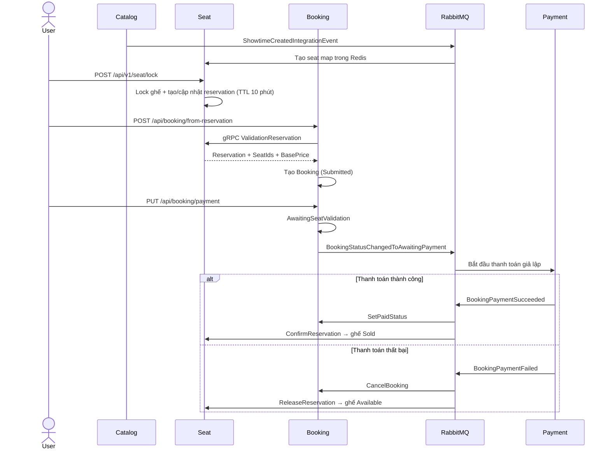

## Kiến trúc hiện tại

Repository đang chạy theo kiểu kết hợp:

- Đồng bộ: Booking gọi Seat qua gRPC để validate reservation.
- Bất đồng bộ choreography: Booking, Payment và Seat trao đổi kết quả thanh toán qua RabbitMQ.
- `SagaOrchestration` chưa tham gia runtime.

## Luồng tổng thể



## 1. Khởi tạo seat map

Khi Catalog tạo showtime:

1. Catalog lấy danh sách ghế theo `HallId`.
2. Lưu showtime và `ShowtimeCreatedIntegrationEvent` bằng outbox.
3. Publish event lên RabbitMQ.
4. Seat nhận event và tạo seat map trong Redis với trạng thái `Available`.

Code liên quan:

- [CreateShowtimeCommandHandler.cs](E:\VNS\Project\99. Learning\.Net\MovieBooking\src\Catalog.API\Application\Showtimes\Commands\CreateShowtime\CreateShowtimeCommandHandler.cs)
- [CatalogIntegrationEventService.cs](E:\VNS\Project\99. Learning\.Net\MovieBooking\src\Catalog.API\IntegrationEvents\CatalogIntegrationEventService.cs)
- [ShowtimeCreatedIntegrationEventHandler.cs](E:\VNS\Project\99. Learning\.Net\MovieBooking\src\Seat.API\IntegrationEvents\EventHandlers\ShowtimeCreatedIntegrationEventHandler.cs)

## 2. User chọn và lock ghế

Client gọi:

```http
POST /api/v1/seat/lock
```

Mỗi ghế được xử lý như sau:

1. Lấy distributed mutex trong 5 giây.
2. Kiểm tra ghế chưa bị lock và đang `Available`.
3. Tạo lock có TTL 10 phút.
4. Đổi ghế sang `Locked`.
5. Tạo hoặc cập nhật `SeatReservation` của user.
6. Lưu seat map và reservation vào Redis.

Một reservation có thể chứa nhiều ghế do user gọi lock nhiều lần.

Code: [LockSeatCommandHandler.cs](E:\VNS\Project\99. Learning\.Net\MovieBooking\src\Seat.API\Application\Seats\Commands\LockSeat\LockSeatCommandHandler.cs)

## 3. Tạo Booking từ reservation

Client gọi:

```http
POST /api/booking/from-reservation
```

Booking gọi đồng bộ:

```text
SeatGrpc.ValidationReservation
```

Seat kiểm tra:

- Reservation tồn tại.
- `reservationId` khớp.
- Chưa hết hạn.
- Có danh sách ghế.
- Tất cả lock vẫn tồn tại.
- Tất cả ghế được lock bởi đúng user.

Nếu hợp lệ, Seat trả về:

- `SeatIds`
- `ShowtimeId`
- `BasePrice`
- `RemainingSeconds`

Booking dùng dữ liệu này để tạo aggregate `Booking` ở trạng thái:

```text
Submitted
```

Code:

- [BookingApi.cs:54](E:\VNS\Project\99. Learning\.Net\MovieBooking\src\Booking.API\Apis\BookingApi.cs:54)
- [SeatService.cs](E:\VNS\Project\99. Learning\.Net\MovieBooking\src\Seat.API\Apis\Grpc\SeatService.cs)
- [ValidationReservationCommandHandler.cs](E:\VNS\Project\99. Learning\.Net\MovieBooking\src\Seat.API\Application\Seats\Commands\ValidationReservation\ValidationReservationCommandHandler.cs)
- [CreateBookingCommandHandler.cs](E:\VNS\Project\99. Learning\.Net\MovieBooking\src\Booking.API\Application\Commands\CreateBooking\CreateBookingCommandHandler.cs)

Sau khi tạo Booking, domain event tạo Buyer và ghi `BookingStatusChangedToSubmittedIntegrationEvent` vào outbox. Tuy nhiên hiện không có service nào subscribe event này.

## 4. Bắt đầu payment

Payment không tự động bắt đầu ngay sau khi tạo Booking. Client phải gọi thêm:

```http
PUT /api/booking/payment
```

Booking chuyển:

```text
Submitted → AwaitingSeatValidation
```

Tên trạng thái hơi lệch ý nghĩa: thực tế bước này đang bắt đầu payment, không phải chờ Seat validation, vì Seat đã được validate bằng gRPC trước đó.

Domain event sau đó tạo:

```text
BookingStatusChangedToAwaitingPaymentIntegrationEvent
```

Event được lưu cùng transaction của Booking, sau commit mới publish lên RabbitMQ.

Code:

- [SetAwaitingPaymentBookingStatusCommandHandler.cs](E:\VNS\Project\99. Learning\.Net\MovieBooking\src\Booking.API\Application\Commands\SetAwaitingPayment\SetAwaitingPaymentBookingStatusCommandHandler.cs)
- [BookingStatusChangedToAwaitingPaymentDomainHandler.cs](E:\VNS\Project\99. Learning\.Net\MovieBooking\src\Booking.API\Application\DomainEventHandlers\BookingStatusChangedToAwaitingPaymentDomainHandler.cs)
- [TransactionBehavior.cs](E:\VNS\Project\99. Learning\.Net\MovieBooking\src\Booking.API\Application\Behaviors\TransactionBehavior.cs)

## 5. Payment xử lý

Payment subscribe `BookingStatusChangedToAwaitingPaymentIntegrationEvent`.

Hiện payment chỉ là giả lập dựa trên:

```json
"PaymentOptions": {
  "PaymentSucceeded": true
}
```

- `true`: chờ 10 giây rồi publish `BookingPaymentSucceededIntegrationEvent`.
- `false`: chờ 3 giây rồi publish `BookingPaymentFailedIntegrationEvent`.

Code: [BookingStatusChangedToAwaitingPaymentIntegrationEventHandler.cs](E:\VNS\Project\99. Learning\.Net\MovieBooking\src\Payment.API\IntegrationEvents\EventHandling\BookingStatusChangedToAwaitingPaymentIntegrationEventHandler.cs)

## 6. Nhánh thành công

`BookingPaymentSucceededIntegrationEvent` được phát tán cho cả Booking và Seat.

Booking:

```text
AwaitingSeatValidation → Paid
```

Seat:

- Kiểm tra reservation.
- Lấy mutex cho toàn bộ ghế.
- Kiểm tra lock còn tồn tại và thuộc user.
- Xóa lock.
- Chuyển ghế sang `Sold`.
- Xóa reservation.

Code:

- [BookingPaymentSucceedIntegrationEventHandler.cs](E:\VNS\Project\99. Learning\.Net\MovieBooking\src\Booking.API\Application\IntegrationEvents\EventHandling\BookingPaymentSucceedIntegrationEventHandler.cs)
- [BookingPaymentSuccededIntegrationEventHandler.cs](E:\VNS\Project\99. Learning\.Net\MovieBooking\src\Seat.API\IntegrationEvents\EventHandlers\BookingPaymentSuccededIntegrationEventHandler.cs)
- [ConfirmReservationCommandHandler.cs](E:\VNS\Project\99. Learning\.Net\MovieBooking\src\Seat.API\Application\Seats\Commands\ConfirmReservation.cs\ConfirmReservationCommandHandler.cs)

Hai consumer chạy độc lập, không có thứ tự bảo đảm.

## 7. Nhánh thất bại

`BookingPaymentFailedIntegrationEvent` cũng được cả Booking và Seat nhận.

Booking:

```text
AwaitingSeatValidation → Cancelled
```

Seat:

- Xóa lock.
- Chuyển ghế về `Available`.
- Xóa reservation.

Code:

- [BookingPaymentFailedIntegrationEventHandler.cs](E:\VNS\Project\99. Learning\.Net\MovieBooking\src\Booking.API\Application\IntegrationEvents\EventHandling\BookingPaymentFailedIntegrationEventHandler.cs)
- [BookingPaymentFailedIntegrationEventHandler.cs](E:\VNS\Project\99. Learning\.Net\MovieBooking\src\Seat.API\IntegrationEvents\EventHandlers\BookingPaymentFailedIntegrationEventHandler.cs)
- [ReleaseSeatReservationCommandHandler.cs](E:\VNS\Project\99. Learning\.Net\MovieBooking\src\Seat.API\Application\Seats\Commands\ReleaseSeatReservation\ReleaseSeatReservationCommandHandler.cs)

## Các event hiện chưa có tác dụng

- `BookingStatusChangedToSubmittedIntegrationEvent`: được publish nhưng không có subscriber.
- `BookingStatusChangedToCancelledIntegrationEvent`: được publish nhưng không có subscriber.
- `BookingStartedIntegrationEvent`: đoạn publish trong Booking đang bị comment; Seat có handler nhưng handler rỗng.
- Trạng thái `SeatConfirmed`: có trong domain nhưng không có code nào gọi `SetSeatConfirmedStatus()`.

## Saga hiện tại

[SagaOrchestration](E:\VNS\Project\99. Learning\.Net\MovieBooking\src\SagaOrchestration) mới là skeleton:

- `BookingSaga` đã có data và `CorrelationId`.
- `BookingStateMachine` mới khai báo state/event.
- Transition và correlation chưa được implement.
- `SeatSaga.cs` và `SeatStateMachine.cs` đang rỗng.
- Project chưa được AppHost/service nào reference.
- Event bus hiện tại là custom RabbitMQ bus, còn Saga dùng MassTransit; hai hệ thống chưa được nối với nhau.

Vì vậy chưa có orchestrator nào ra lệnh hoặc theo dõi toàn bộ transaction.

## Những rủi ro quan trọng trước khi chuyển sang Saga

1. Payment success có thể làm Booking thành `Paid`, nhưng Seat xác nhận ghế thất bại hoặc reservation đã hết hạn.

2. Seat có thể chuyển ghế thành `Sold`, nhưng Booking consumer thất bại và không chuyển được thành `Paid`.

3. Payment publish trực tiếp, chưa dùng outbox.

4. Seat lưu Redis và xử lý event nhưng không có outbox/inbox hoặc idempotency rõ ràng.

5. RabbitMQ consumer vẫn `Ack` message ngay cả khi handler throw exception tại [RabbitMQEventBus.cs:181](E:\VNS\Project\99. Learning\.Net\MovieBooking\src\EventBusRabbitMq\RabbitMQEventBus.cs:181). Event lỗi sẽ bị mất thay vì retry/DLQ.

6. Seat event handler bỏ qua kết quả của `ConfirmReservationCommand` và `ReleaseSeatReservationCommand`.

7. Lock ghế có TTL 10 phút nhưng Saga/payment chưa quản lý timeout. Payment đến trễ có thể báo thành công sau khi reservation đã hết hạn.

Điểm hợp lý để bắt đầu Saga là khi Booking đã được tạo và reservation đã được validate. `ReservationId` nên là correlation key xuyên suốt Booking–Payment–Seat, vì nó tồn tại trước `BookingId` và đã có trong tất cả event thanh toán.